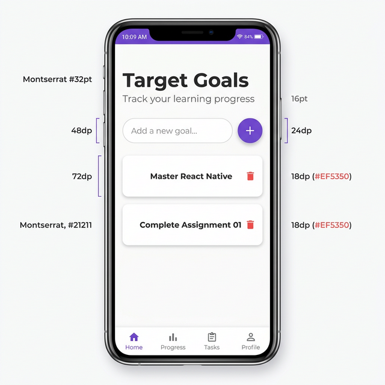

# Assignment 1 Report - To-Do List App
**Developer**: [Eman Mohammed Hamed]  
**Subject**: Mobile Computing

---

## 1. Design System

### Color Palette
I have chosen a clean, professional "Midnight Purple" palette to give the app a modern and premium feel.

| Element | Color Code | Description |
| :--- | :--- | :--- |
| **Primary** | `#5e0acc` | Used for buttons and highlights. |
| **Background** | `#f8f9fa` | Light gray background for better readability. |
| **Card Background** | `#ffffff` | Pure white cards with subtle shadows. |
| **Titles** | `#1a1a1a` | High contrast dark gray for main headers. |
| **Subtitles** | `#666666` | Medium gray for helper text. |
| **Action: Delete** | `#ff4444` | Contrast red for the trash icon. |

### Fonts
The application uses the **Montserrat** font family via `@expo-google-fonts/montserrat`.
- **Montserrat_700Bold**: Used for the main header ("Target Goals").
- **Montserrat_400Regular**: Used for input fields, subtitles, and list items.

---

## 2. Application Screenshots

Below is a professional mockup representing the final design and functionality of the application.

---

## 3. Implementation Details

### Core Components
- **Text (Title)**: Displays "Target Goals" with Bold Montserrat font.
- **TextInput**: Custom-styled input field for entering new learning goals.
- **Button (TouchableOpacity)**: A purple "+" button that triggers the goal addition logic.
- **FlatList**: Efficiently renders the list of goals with scrolling support.

### State & Logic
- `enteredGoalText`: State to track the keyboard input.
- `courseGoals`: State array to store the list of objects `{ text, id }`.
- `addGoalHandler`: Function that validates input and updates the list.
- `deleteGoalHandler`: Function that filters out a goal by ID.

---

## 4. How to Use
1. **Add**: Type a goal and press the purple button.
2. **Scroll**: If you have many goals, the `FlatList` handles scrolling automatically.
3. **Delete**: Tap the red trash icon next to any goal to remove it.

---

## 5. Deployment Links
- **Expo Snack**[https://snack.expo.dev/@emy5/assignment01_todolist]
- **GitHub Repo**: [https://github.com/Eman-Mohamed-Hamed/mobile-computing-assignment01]

*Note: As this is a local development environment, please copy the code into your Expo Snack / GitHub account as per instructions.*

